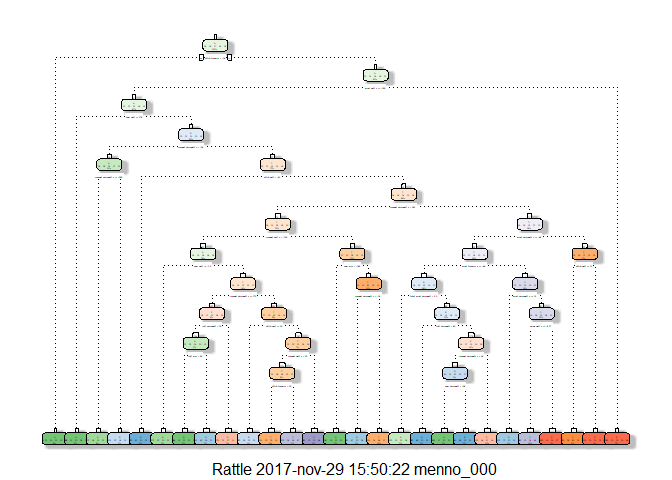

Practical Machine learning assignment
================
Menno Oerlemans
27 november 2017

Assignment
==========

Summary
-------

In the background chapter below is the assignment described:

The goal of your project is to predict the manner in which they did the exercise. This is the "classe" variable in the training set. You may use any of the other variables to predict with. You should create a report describing how you built your model, how you used cross validation, what you think the expected out of sample error is, and why you made the choices you did. You will also use your prediction model to predict 20 different test cases.

To adress these questions I built four models (Random Forest, boosted trees ("gbm") and linear discriminant analysis ("lda") model and decision tree). I splitted the trainingset in a train and a test set. So I could compare the different models and I choose the one with te best accuracy. I used this model to predict the 20 different testcases.

The model selected was the Random Forest model. This model had the highest accuracy.

Background
----------

Using devices such as Jawbone Up, Nike FuelBand, and Fitbit it is now possible to collect a large amount of data about personal activity relatively inexpensively. These type of devices are part of the quantified self movement - a group of enthusiasts who take measurements about themselves regularly to improve their health, to find patterns in their behavior, or because they are tech geeks. One thing that people regularly do is quantify how much of a particular activity they do, but they rarely quantify how well they do it. In this project, your goal will be to use data from accelerometers on the belt, forearm, arm, and dumbell of 6 participants. They were asked to perform barbell lifts correctly and incorrectly in 5 different ways. More information is available from the website here: <http://groupware.les.inf.puc-rio.br/har> (see the section on the Weight Lifting Exercise Dataset).

Solution
========

Loading and preparing the data
------------------------------

In this chunk the data is loaded from the given site. Because it looks like the trainingset is almost 20.000 observations and the test set is 20 observations the trainingset is broken down into a test and trainingset. The original test set is going to be the validation set.

``` r
Url_Train <- "http://d396qusza40orc.cloudfront.net/predmachlearn/pml-training.csv"
Url_Test  <- "http://d396qusza40orc.cloudfront.net/predmachlearn/pml-testing.csv"

# download the datasets
train<- read.csv(url(Url_Train), header=TRUE, na.strings=c("NA", "#DIV/0!"))
test  <- read.csv(url(Url_Test), header=TRUE, na.strings=c("NA", "#DIV/0!"))

## NA exclusion for all available variables
train<-train[, apply(train, 2, function(x) !any(is.na(x)))] 

## exclusion of variables with user information, time and undefined
train <-train[,-c(1:8)]

## define the testset (according the train set and without classe variable)
test <- test[ , colnames(train[,-52])]

downloaddatum <- Sys.Date()
print(downloaddatum)
```

    ## [1] "2017-11-29"

Defining a train, test and validation set (originally the test set)
-------------------------------------------------------------------

``` r
# building a validation, test and train set
validation <- test
inTrain  <- createDataPartition(train$classe, p=0.7, list=FALSE)
train <- train[inTrain, ]
test  <- train[-inTrain, ]
dim(train)
```

    ## [1] 13737    52

``` r
dim(test)
```

    ## [1] 4102   52

Training the models
-------------------

``` r
set.seed(1)
mod_rf <- train(classe ~ ., data = train, method = "rf")
mod_gbm <- train(classe ~ ., data = train, method = "gbm")
mod_lda <- train(classe ~ ., data = train, method = "lda")
```

    ## Loading required package: MASS

    ## 
    ## Attaching package: 'MASS'

    ## The following object is masked from 'package:dplyr':
    ## 
    ##     select

``` r
mod_dt <- rpart(classe ~ ., data = train, method="class")
```

Print the Decision tree model
-----------------------------

``` r
fancyRpartPlot(mod_dt)
```

    ## Warning: labs do not fit even at cex 0.15, there may be some overplotting



Testing the models and selecting the best model
-----------------------------------------------

``` r
pred_rf <- predict(mod_rf, test)
pred_gbm <- predict(mod_gbm, test)
pred_lda <- predict(mod_lda, test)
pred_dt <- predict(mod_dt, test, type = "class")

confusionMatrix(pred_rf, test$classe)$overall[1]
```

    ## Accuracy 
    ##        1

``` r
confusionMatrix(pred_gbm, test$classe)$overall[1]
```

    ##  Accuracy 
    ## 0.9748903

``` r
confusionMatrix(pred_lda, test$classe)$overall[1]
```

    ##  Accuracy 
    ## 0.6923452

``` r
confusionMatrix(pred_dt, test$classe)$overall[1]
```

    ##  Accuracy 
    ## 0.7181863

Prediction on the validation set
--------------------------------

``` r
pred_rf_val <- predict(mod_rf, validation)
pred_rf_val
```

    ##  [1] B A B A A E D B A A B C B A E E A B B B
    ## Levels: A B C D E
